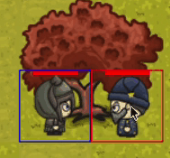

# Arena-of-Heroes
## Participants 
 - **Michał Kacprzak - Team Leader**
 - Agnieszka Lasek
 - Tomasz Maczek
 - Bartek Mikołajczyk
### Do you need more people: No
## Short description of the idea
Arena of Heroes will be a 2D multiplayer RPG game. The player's task will be to create a team of heroes that will go to battle to the death in the arena. More information soon...
Full description available [here](project_description.odt)
## Feature'y:
- player registration
- option to save and load a game
- team creator
- 5 diffrent class of heroes
- 1 vs 1 
- possibility to play against the computer to improve skills
- randomly generated map
## Demo:
### Walking:

